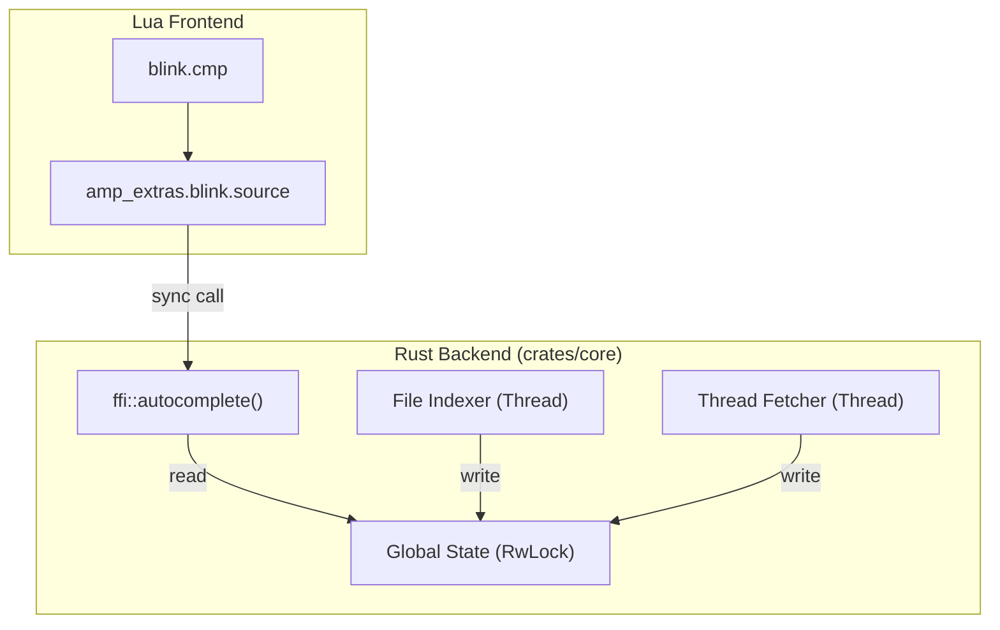

# Autocomplete Implementation Plan

This plan outlines the implementation of the autocomplete feature for `amp-extras.nvim`, replicating the functionality of the old Lua implementation but leveraging the Rust backend for performance.

## Architecture

The system will use a **Synchronous FFI with Background Caching** approach.
- **Rust Backend (`crates/core`)**: Maintains in-memory caches for files and threads. Heavy operations (file walking, fetching threads) run in background threads to avoid blocking the Neovim UI.
- **Lua Frontend (`lua/amp_extras/`)**: Defines `blink.cmp` sources that query the Rust backend.



## 1. Rust Backend Implementation

### 1.1 Dependencies
Add the following to `crates/core/Cargo.toml`:
- `ignore`: For fast file walking respecting `.gitignore`.
- `frizbee`: For SIMD-accelerated fuzzy matching.
- `once_cell` or `lazy_static`: For global state (if not already present/sufficient).

### 1.2 Global State
Implement a global `State` struct in `crates/core/src/lib.rs` (or a new `completion` module) using `once_cell::sync::Lazy` and `RwLock`.

```rust
struct State {
    files: RwLock<FileCache>,
    threads: RwLock<ThreadCache>,
}

struct FileCache {
    items: Vec<String>,
    last_updated: Instant,
    is_updating: bool,
}

struct ThreadCache {
    items: Vec<ThreadItem>,
    last_updated: Instant,
    is_updating: bool,
}
```

### 1.3 File Indexing
- Use `ignore::WalkBuilder` to walk the directory tree.
- Spawn a background thread (`std::thread::spawn`) to update the cache.
- Trigger update if cache is empty or stale (TTL).

### 1.4 Thread Fetching
- Execute `amp threads list --json` using `std::process::Command`.
- Parse output with `serde_json`.
- Spawn a background thread to update the cache.
- Trigger update if cache is empty or stale (TTL).

### 1.5 FFI Export
Update `crates/core/src/ffi.rs`:
- `autocomplete(kind: String, prefix: String) -> Result<Vec<String>>`:
  - Checks cache for `kind`.
  - Triggers background update if needed.
  - Uses `frizbee` to fuzzy match cached items against `prefix`.
  - Returns top matches (e.g., limit to 100) ranked by score.

## 2. Lua Frontend Implementation

### 2.1 Blink Source (`lua/amp_extras/blink/source.lua`)
- Implement `blink.cmp` source interface.
- `get_trigger_characters()`: Returns `{'@'}`.
- `get_completions(ctx, callback)`:
  - Calls `require("amp_extras.core").autocomplete(kind, prefix)`.
  - Returns formatted completion items.
  - Supports both `file` and `thread` items.

### 2.2 Highlights (`lua/amp_extras/blink/highlights.lua`)
- Define highlight groups for file and thread icons/labels.

### 2.3 Config
- Add configuration for cache TTLs and icons.

## 3. Step-by-Step Implementation Plan

1.  **Update Dependencies**: Add `ignore` and `frizbee` to `crates/core/Cargo.toml`.
2.  **Implement Rust Logic**:
    - Create `crates/core/src/completion.rs`.
    - Implement `State`, `FileCache`, `ThreadCache`.
    - Implement background update logic.
3.  **Expose FFI**:
    - Update `crates/core/src/ffi.rs` to call `completion::autocomplete`.
4.  **Implement Lua Source**:
    - Create `lua/amp_extras/blink/source.lua`.
    - Create `lua/amp_extras/blink/highlights.lua`.
    - Integrate with `blink.cmp`.
5.  **Test**:
    - Verify file completions work and respect `.gitignore`.
    - Verify thread completions work (mock `amp` command if needed or test with actual CLI).
    - Ensure UI is non-blocking during cache updates.

## 4. Constraints & Notes
- **Performance**: Main FFI call must never block. File walking and CLI execution MUST be in background threads.
- **Safety**: Use `RwLock` for thread-safe access to global state.
- **Fallbacks**: If `amp` CLI fails, return empty list or stale data, do not crash.
